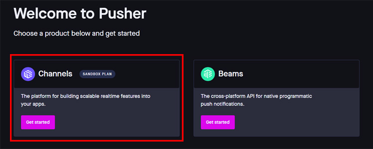
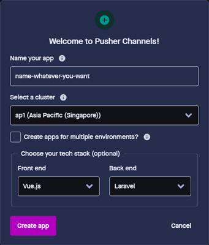

# Laravel Chat App
A realtime chatting application built in Laravel and Vue.


## Tech / Framework used
#### Built with:
- [Laravel 7](https://laravel.com) (v7.30.1)
- [VueJS](https://vuejs.org)
- [Bootstrap 4](https://getbootstrap.com)
- [IconsPlugin](https://bootstrap-vue.org) (but doesn't use BootstrapVue)
- [Pusher Channels](https://pusher.com)
- Axios
- MariaDB 10.1.38

#### My machine specification
- PHP 7.3.2
- npm v6.9.0
- Composer v2.0.8


## Getting started
```bash
# clone this repository
git clone https://github.com/iqbaltaufiq/laravel-chat-app.git

# change into project directory
cd laravel-chat-app

# install dependencies
composer install

# copy .env.example file and rename it to .env
cp .env.example .env

# modify the database configuration in .env file as you prefer

# generate application key
php artisan key:generate

# create a symbolic link to storage directory
php artisan storage:link

# change the BROADCAST_DRIVER value in .env file from log to pusher
BROADCAST_DRIVER=pusher

# set the PUSHER_* value in .env file (see instruction below about how to get the pusher key)
PUSHER_APP_ID=insert_app_id
PUSHER_APP_KEY=insert_app_key
PUSHER_APP_SECRET=insert_app_secret
PUSHER_APP_CLUSTER=insert_cluster

# run migration
php artisan migrate

# install node_modules
npm install

# compile assets
npm run dev || npm run watch

# run in development mode
php artisan serve  #localhost:8000
```

## Pusher Configuration
In order to be able to send message in realtime, we need to use a two-way interactive communication tools (like pusher or socket.io). In this case, we are going to use pusher.
1. Visit [pusher.com](https://pusher.com)
2. Create an account or login with your Google/Github account.
3. Select `Channels`



4. Set the configuration like the given picture below.
	- Name doesn't have to be same as your project repository's
	- Select a cluster that is closest to your location
	- Choose `vue.js` as frontend and `laravel` as backend
	
	
	
5. Click `Create app`
6. Click `App Keys` on the sidebar.
7. Copy and paste all the values to the `PUSHER_*` variables in the `.env` file, like the example below.
```dotenv
PUSHER_APP_ID=1410681
PUSHER_APP_KEY=7wg8c7b4ae4cf9ec25ta
PUSHER_APP_SECRET=5521876f8f9c1a82d496
PUSHER_APP_CLUSTER=ap1
```

> Learn more about Pusher Channels and Laravel Broadcast [here.](https://laravel.com/docs/7.x/broadcasting)

## Features
- Send and receive messages in realtime
- Add and remove friends
- Receive a friend request notification when someone added you as a friend
- Clear one particular chat (without deleting the chatroom)
- Delete chatroom (the chatroom and all the chats that belongs to that chatroom)
- Delete all chatrooms
- Change your name and profile photo

### Unavailable Features
Unfortunately, this app supported text-based message only. You can neither send any attachment (e.g. file, image, video, etc.) nor make a voice/video call.

## License
MIT License

Copyright &copy; 2021 [Iqbal Taufiqurrahman](https://github.com/iqbaltaufiq)